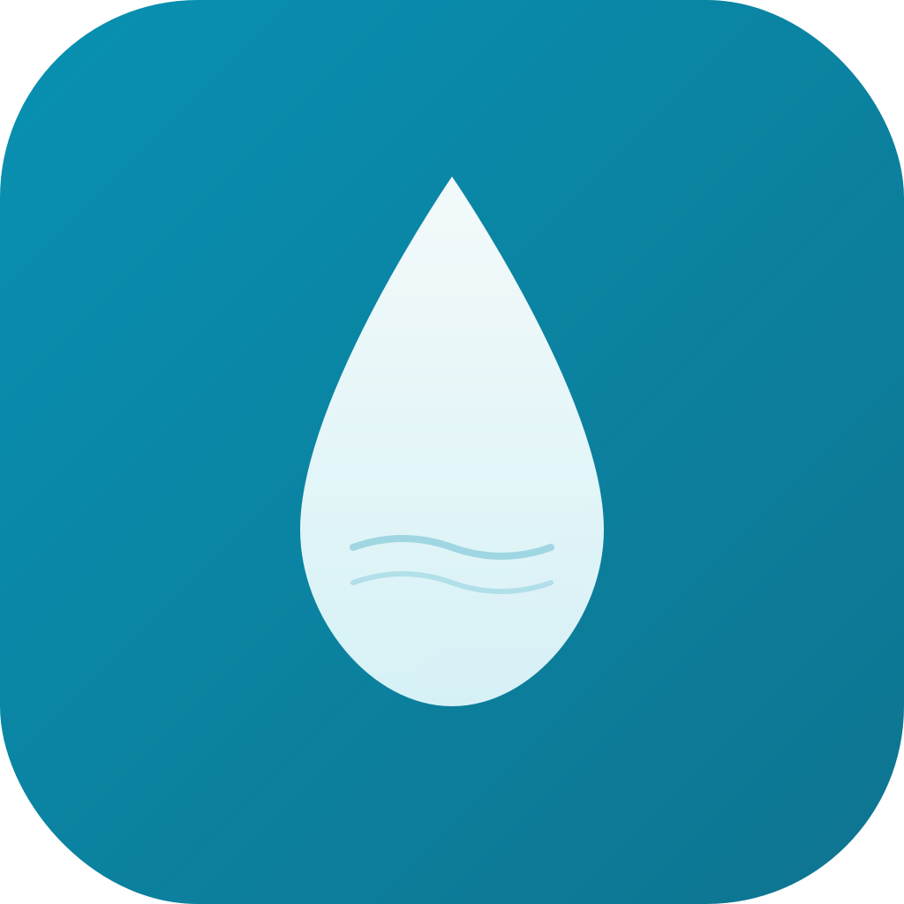
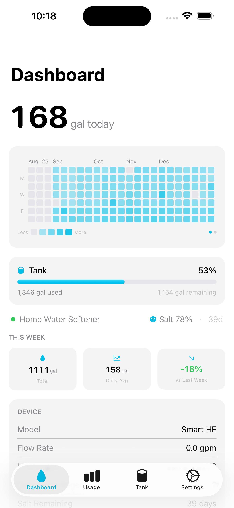

<div align="center">



# Aqualytics

**Long-term water usage analytics for your Culligan® water softener.**

[](https://www.apple.com/ios/)
[](https://swift.org)
[](https://developer.apple.com/xcode/swiftui/)

[Privacy Policy](https://dwcares.github.io/aqualytics-ios/privacy/) · [Support](https://dwcares.github.io/aqualytics-ios/support/)

<br>



</div>

---

> **Not affiliated with Culligan.** Aqualytics is an independent companion app and is not affiliated with, endorsed by, or sponsored by Culligan International. "Culligan" and "Culligan Connect" are trademarks of Culligan International, referenced here only to describe compatibility.

Aqualytics turns your Culligan Smart HE softener's data into insights the official app doesn't surface. Where most apps show only the last 30 days, Aqualytics keeps an **unlimited local history** so you can spot trends across months and years — all stored privately on your device.

## Features

- **Dashboard** — today's usage front and center, a GitHub-style calendar heatmap of daily usage, weekly trend insights, device status and salt level.
- **Usage history** — interactive Swift Charts with 7 / 30 / 90-day and all-time views, drag-to-select date ranges, and full pagination through your history.
- **Tank tracking** *(optional)* — monitor a septic or holding tank with an animated fill gauge, color-coded warnings, and pump-event history.
- **Home screen widgets** — today's gallons, the usage heatmap, and a tank fill gauge.
- **Smart notifications** — usage-spike (leak) detection, tank-full warnings, salt reminders, and device-offline alerts.
- **Export** — CSV or PDF reports for any date range, shared via the system share sheet.
- **Privacy first** — no backend, no analytics, no tracking. Your data never leaves your device.

## Requirements

- iPhone running **iOS 17** or later
- A compatible **Culligan Smart HE** water softener with Wi-Fi
- A **Culligan Connect** account (used to sign in)

## Tech stack

- **SwiftUI** + **SwiftData**, targeting iOS 17, **Swift 6** with complete strict concurrency
- **WidgetKit** extension sharing data with the app via an App Group
- Actor-based API client; token auth stored in the Keychain
- **[XcodeGen](https://github.com/yonaskolb/XcodeGen)** generates the Xcode project from [`project.yml`](project.yml)

## Getting started

```bash
# 1. Generate the Xcode project (required after cloning or editing project.yml)
xcodegen generate

# 2. Build
xcodebuild -project CulliganApp.xcodeproj -scheme CulliganApp -sdk iphonesimulator build

# 3. Run unit tests
xcodebuild -project CulliganApp.xcodeproj -scheme CulliganAppTests \
  -sdk iphonesimulator -destination 'platform=iOS Simulator,name=iPhone 16 Pro' test
```

Or just open `CulliganApp.xcodeproj` in Xcode and run the **CulliganApp** scheme.

> **Tip:** In a Debug build, **Settings → Developer → Load Demo Data** seeds realistic sample data so you can explore the app (or capture screenshots) without a live account. It's compiled out of release builds.

## Project structure

```
CulliganApp/
├── CulliganAPI/      # API client, Keychain, auth/device/command models
├── Data/             # SwiftData models + shared ModelContainer (App Group)
├── ViewModels/       # @Observable view models
├── Views/            # SwiftUI views by feature (Dashboard, Usage, Tank, …)
├── Services/         # Background refresh, notifications, sync, export
└── Debug/            # DEBUG-only helpers (sample data)
CulliganWidgetExtension/   # Home screen widgets
docs/                      # GitHub Pages site (privacy + support)
```

## Privacy

All water-usage data, settings, and credentials are stored **locally** on device (SwiftData + Keychain). The app talks directly to the Culligan IoT API to fetch *your* device's data — nothing is sent to any server operated by this project. See the full [Privacy Policy](https://dwcares.github.io/aqualytics-ios/privacy/).

## License

Personal project, provided as-is. See the not-affiliated notice above regarding trademarks and third-party APIs.
